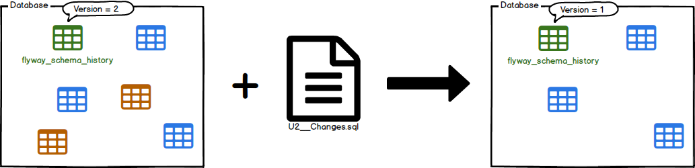

# Flyway

## 🫥 DB 마이그레이션의 필요성

### 코드는?
- 버전 관리는 계속해서 발전하는 툴(git, svn...)로 관리 합니다.
- 재현 가능한 빌드와 지속적인 통합이 있습니다.
- 잘 정의된 릴리즈 및 배포 프로세스를 가지고 있습니다.

### 하지만 DB는?
많은 프로젝트가 여전히 수동적으로 SQL 스크립트에 의존하게 됩니다.
그리고 여러가지 질문이 생깁니다.
- 이 기기의 데이터베이스는 어떤 상태인가?
- 이 스크립트가 이미 적용 되었는가? 적용되지 않았는가?
- 제품의 수정사항이 테스트에 적용 되었는가?
- 새 데이터베이스 인스턴스는 어떻게 설정하는가?

### DB 마이그레이션은 이러한 혼란을 제어할 수 있는 좋은 방법입니다.
- 데이터베이스를 처음부터 다시 생성
- 데이터베이스가 어떤 상태인지 명확히 확인 가능
- 현재 버전의 데이터베이스에서 최신 버전으로 결정적인 마이그레이션

## 🐶 Flyway 동작원리
가장 쉬운 시나리오는 Flyway가 빈 DB를 가리키는 경우 입니다.

스키마 기록 테이블을 찾으려고 시도하지만, DB가 비어 있으므로 **생성**합니다.
생성하게 되면 기본적으로 **flway_schema_history(변경 이력 관리 테이블)** 라는 테이블이 생성되게 되빈다.

**flway_schema_history**는 DB 상태 추적하는데 사용됩니다.
즉시 Flyway는 마이그레이션을 위해 응용 프로그램의 파일 시스템 또는 클래스 경로를 **스캔**하기 시작합니다.
이것은 Sql 또는 Java로 작성할 수 있습니다.

그런 다음 마이그레이션은 **버전 번호**를 기준으로 **정렬**되고 순서대로 적용됩니다.

각 마이그레이션이 적용되면 그에 따라 스키마 기록 테이블이 업데이트 됩니다.

<table>
    <thead>
        <tr>
            <th>installed_rank</th>
            <th>version</th>
            <th>description</th>
            <th>type</th>
            <th>script</th>
            <th>checksum</th>
            <th>installed_by</th>
            <th>installed_on</th>
            <th>execution_time</th>
            <th>success</th>
        </tr>
    </thead>
    <tbody>
        <tr>
            <td>1</td>
            <td>1</td>
            <td>Initial Setup</td>
            <td>SQL</td>
            <td>V1_Initial_Setup.sql</td>
            <td>1996767037</td>
            <td>midas</td>
            <td>2022-06-20 10:50:00</td>
            <td>546</td>
            <td>true</td>
        </tr>
    </tbody>
</table>

**메타데이터와 초기 상태가 준비되었으므로 이제 새 버전으로 마이그레이션**에 대해 이야기할 수 있습니다.

Flyway는 마이그레이션을 위해 응용 프로그램의 파일 시스템 또는 클래스 경로를 다시 한번 검색합니다.
마이그레이션은 스키마 기록 테이블에 대해 확인되빈다.
버전 번호가 현재로 표시된 버전 중 하나보다 낮거나 같으면 무시됩니다.

나머지 마이그레이션은 **보류 중인 마이그레이션** 입니다. 사용 가능하지만 적용되지 않습니다.

그런 다음 **버전 번호별로 정렬되고 순서 대로 실행**됩니다

이에 따라 **스키마 기록 테이블이 업데이트** 됩니다.

이게 전부입니다. 데이터베이스 변경 사항이 있다면 현재 버전보다 높은 번호로 새 마이그레이션을 생성하면 됩니다.
다음에 Flyway가 시작되면 이를 찾으 그에 따라 데이터베이스를 업그레이드 합니다.

## 🧩 파일명 관리

- Prefix
    - V : 버전 마이그레이션
    - U : 복구 마이그레이션
    - R : 반복 마이그레이션
- Version
    - 버전 값(숫자) 기입
    - R(반복 마이그레이션)에서는 버전을 명시하면 filename 제약 위반사항으로 오류 발생!
- Separator : __ (밑줄 2개) **(✨ 꼭 2개를 붙여야 함!)**
- Description : 밑줄(Runtime 시, 자동으로 공백으로 대체 됨)을 이용해서 설명 적기

## 🔫 Command (실행 명령)
- Migration : 스키마를 최신 버전으로 마이그레에션
  
    - flyway 이력 테이블이 없는 경우 자동으로 생성
    - Flyway 워크 플로우의 핵심
    - 사용 가능한 마이그레이션에 대해 파일 시스템 또는 클래스 경로를 스캔 → DB 적용된 마이그레이션과 비교 후에 격차를 줄임
    - DB와 코드의 비호환성을 피하기 위해 마이그레이션은 응용 프로그램 시작 시 실행하는 것을 추천
- Undo : 가장 최근에 적용된 버전이 지정된 마이그레이션을 실행 취소 합니다.

  

    - 지정한 타겟 보다 낮은 마이그레이션에 도달할 때까지 적용된 순서대로 버전지 지정된 마이그레이션을 실행 취소하려고 시도합니다.
    - 활성화 된 경우 group 단일 트랜잭션 내에서 이러한 모든 마이그레이션을 실행 취소하려고 실행합니다.
    - 실행 취소할 버전이 지정된 마이그레이션이 없는 경우 요청해도 효과 X
    - R (반복 가능한 마이그레이션) - 실행 취소 기능 없음.

      🤔 이 경우에는 원하는 이전 상태를 포함하도록 수정한 다음 마이그레이션을 사용하여 다시 적용 해야됨??
- Info : 모든 마이그레이션 상세 정보를 출력한다.
  
- Validate : DB 적용된 마이그레이션 정보 유효성 검증

  

    - DB 적용된 마이그레이션과 로컬에서 사용 가능한 마이그레이션이 일치하는지 확인
    - Validate 마이그레이션이 실행 될 때, 체크섬을 저장하여 작동
    - 로컬 마이그레이션이 DB에서 이미 실행된 마이그레이션과 여전히 동일한 체크섬을 가지고 있는지 확인
- Baseline : flyway 관리 이전에 DB 존재할 경우, 해당 DB를 flyway baseline 으로 설정

  

    - 이렇게 하면 Migrate가 기준 버전까지 모든 마이그레이션을 무시 → 새로운 마이그레이션이 평소와 같이 적용
- Repair : 메타 데이터 테이블 문제를 해결하기 위해 사용

  

    - 실패한 마이그레이션 항목 제거 (DDL 트랜잭션을 지원하지 않는 DB만 해당)
    - 적용된 마이그레이션의 체크섬을 사용 가능한 마이그레이션의 체크섬으로 재정렬
    - 누락된 모든 마이그레이션을 삭제된 것으로 표시
        - 결과적으로 repair가 반드시 migrate와 같은 위치에 있어야 합니다.

- Clean : 구성된 스키마의 모든 객체를 삭제

  

    - 초기화 할 수 있어, 개발 및 테스트에 큰 도움이 됩니다.
    - **🚫 운영중인 본 DB에 사용하지 말라고 경고하고 있음!**
    - Check : 현재 베타 버전.
        - 마이그레이션에 대한 신뢰도를 높이기 위해 보고서를 생성
        - 임시 DB에 대해 마이그레이션 하고, 보고서를 생성하기 위해 이를 대상 DB와 비교.
        - **임시 DB를 사용하기 전에 정리되므로, 중요한 내용이 포함되어 있지 않은지 확인 필요!!**