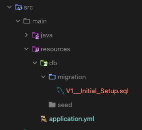
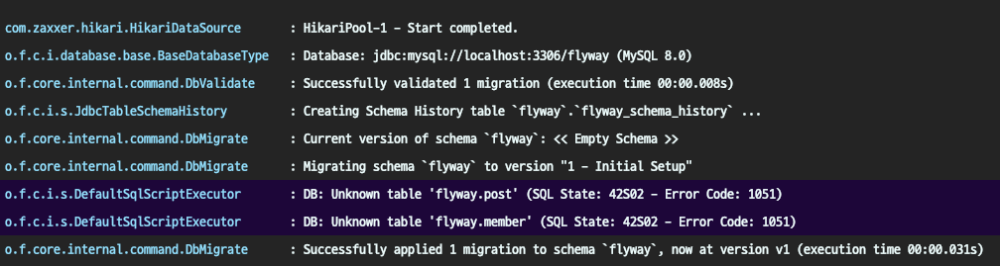
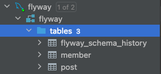
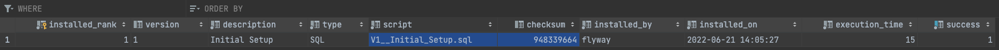

# Flyway 사용법

## 📌 개발 환경
- java 17
- Spring Boot 2.7.0
- flyway 8.5.12
- mysql 8.0

## ⚙ ️설정
### 1. 라이브러리 추가
`mysql`을 사용하는 경우, mysql 까지 추가하기 
```xml
<dependency>
    <groupId>org.flywaydb</groupId>
    <artifactId>flyway-core</artifactId>
    <version>${flyway.version}</version>
</dependency>

<!-- Mysql 사용 하는 경우, 추가-->
<dependency>
    <groupId>org.flywaydb</groupId>
    <artifactId>flyway-mysql</artifactId>
    <version>${flyway.version}</version>
</dependency>
```
### 2. application.yml 설정 추가
```yaml
spring:
  datasource:
    driver-class-name: com.mysql.cj.jdbc.Driver
    url: DB_URL
    username: DB_ID
    password: DB_PASSWORD
  jpa:
    generate-ddl: false  # ✨ ddl 기능 false 처리
    hibernate:
      ddl-auto: validate # ✨ validate 사용하기
  sql:
    init:
      data-locations: classpath*:/db/seed/data.sql # data.sql 설정 경로 추가 
      mode: always # data.sql 을 항상 실행 하도록 설정
  flyway:
    enabled: true 
    baseline-on-migrate: true # Spring boot 2 이상인 경우 자동으로 생성되지 않는 경우가 있었다...? 🤔
    locations: classpath:db/migration # 기본 설정 값이지만 명시적으로 설정하는 것을 추천
```

### 3. 폴더 만들기
```
resrouces
  ⌙ db
    ⌙ migration
    ⌙ seed          
```

## 🏃 가즈아
테스트 를 위한 Member, Post 엔티티를 생성합니다.
```java
@Entity
public class Member {

	@Id
	@GeneratedValue(strategy = GenerationType.IDENTITY)
	private Long id;

	private String email;
	private String password;

        // ...
}

@Entity
public class Post {

	@Id
	@GeneratedValue(strategy = GenerationType.IDENTITY)
	private Long id;

	private String content;

	@ManyToOne(fetch = FetchType.LAZY)
	@JoinColumn(name = "member_id")
	private Member member;

	// ...
}
```


이제 위의 테이블을 만들어 주기 위해 DDL 쿼리 스크립트를 작성해야 합니다.



위와 같이 **V1__Initial_Setup.sql** 생성합니다. (✨ 버전 뒤에 언더스코어 2개 잊지 말자!)
```sql
DROP TABLE IF EXISTS post;
DROP TABLE IF EXISTS member;

CREATE TABLE member (
    id BIGINT NOT NULL PRIMARY KEY AUTO_INCREMENT,
    email VARCHAR(255),
    password VARCHAR(255)
);

CREATE TABLE post (
  id BIGINT NOT NULL PRIMARY KEY AUTO_INCREMENT,
  content VARCHAR(255),
  member_id BIGINT NOT NULL,
  FOREIGN KEY (member_id) REFERENCES member(id)
);
```

### 이제 실행을 해보면...?



일단 로그를 보시면 마이그레이션이 성공적으로 적용된것을 확인할 수 있습니다.



이력 관리 테이블과 DDL 작성한 테이블들이 만들어진 것도 확인할 수 있구요.



초기 설정 이력 데이터도 확인할 수 있습니다.


```shell
# migration 확인
flyway -configFiles=./src/main/resources-local/flyway_main.conf migrate

# repeatable 확인
flyway -configFiles=./src/main/resources-local/flyway_seed.conf migrate
```